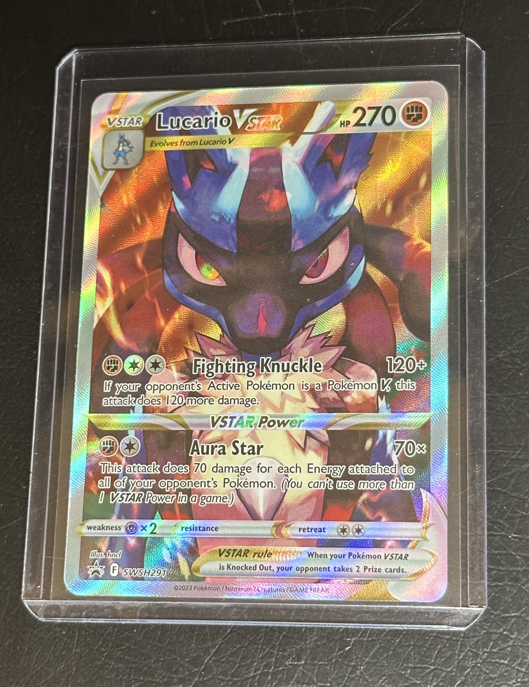
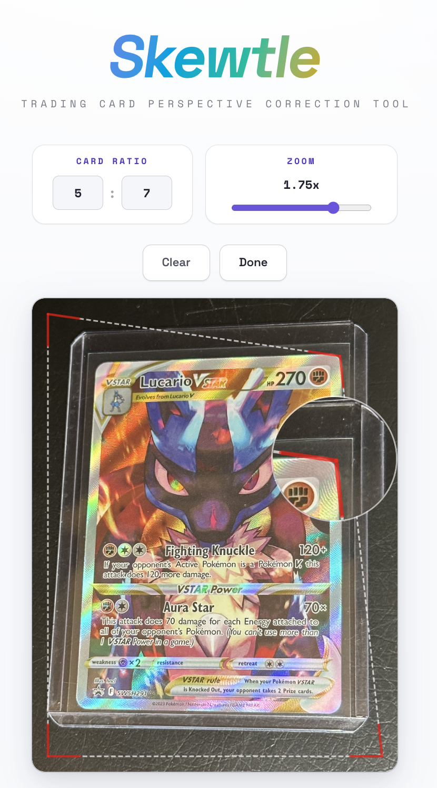
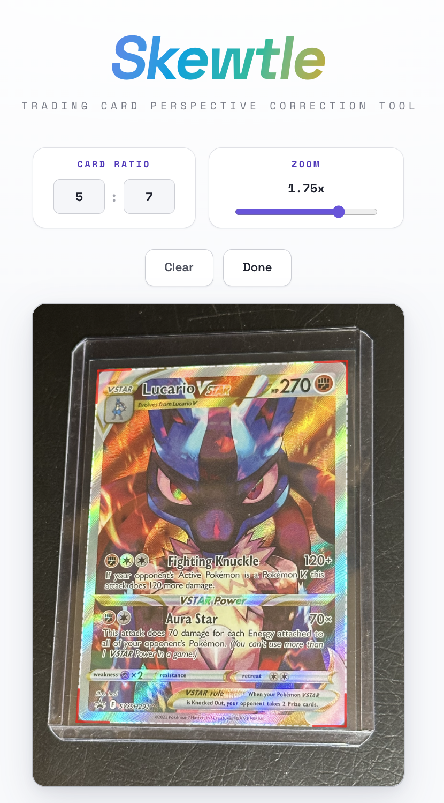
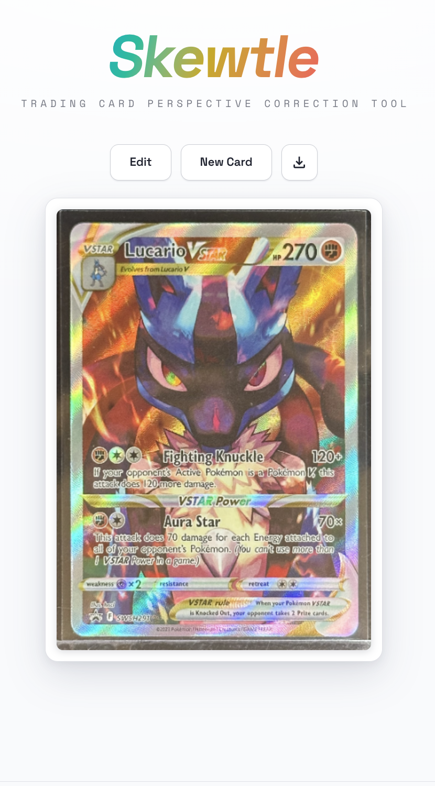

# Skewtle

A trading card perspective correction tool. Upload a photo of a card taken at an angle, drag the corner handles to align with the card edges, and Skewtle will flatten and crop it into a clean output image.

## Why

When photographing trading cards without a scanner for listings, collections, or sharing it's hard to get a perfectly flat, top-down shot. Small angles and perspective distortion make cards look skewed, uneven, or unprofessional. Listings of cards taken without a scanner are rarely taken perfectly top-down which make it difficult to assess centering. Dedicated scanning hardware fixes this but isn't always accesible.

Manually correcting perspective in photo editing apps is tedious, it requires precise adjustments, doesn't preserve the correct card aspect ratio, and still often leaves borders unevenly cropped. Other browser-based tools that attempt perspective correction tend to crop too tightly, cutting off card borders, or produce stretched output that's unusable for grading or centering assessment.

Skewtle solves this in the browser. You take a photo however is convenient, then use the corner handles to define the card's edges. Skewtle applies a perspective transform to produce a clean, correctly proportioned output. No scanner, no desktop software and no upload to a third-party service.

## Limitations

Output accuracy and quality are dependent on the user's ability to precisely align the corner handles to the card edges, and the image quality of the source photo.

The card must be photographed flat, in a toploader, or in a slab — warped or bent cards will produce inaccurate results. It is also recommended that the card fills a reasonable portion of the frame; too much background space around the card makes corner placement less precise and can reduce output quality.

## Features

- Drag corner handles to define the card region
- Magnified loupe overlay while dragging for precise placement
- Configurable card aspect ratio (default 5:7 — works for Pokémon, One Piece, Magic: The Gathering, etc.)
- Adjustable zoom level for the loupe
- Download the corrected image

## Getting Started

```bash
npm install
npm run dev
```

## Tech Stack

- React + TypeScript
- Vite
- Konva / react-konva (canvas rendering)
- [homography](https://www.npmjs.com/package/homography) (perspective transform)

## Usage

1. Set the card ratio if it differs from the default 5:7
2. Upload or drag and drop a photo of your card

   

3. Drag the four corner handles to the corners of the card and align the edges

   

   

4. Press **Done** to apply the perspective correction and download the result

   

   

> For best results, photograph the card flat with some background visible around all edges.

## License

MIT
